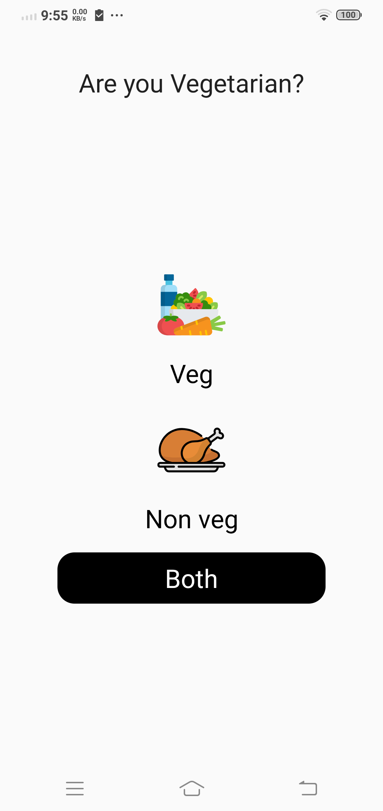
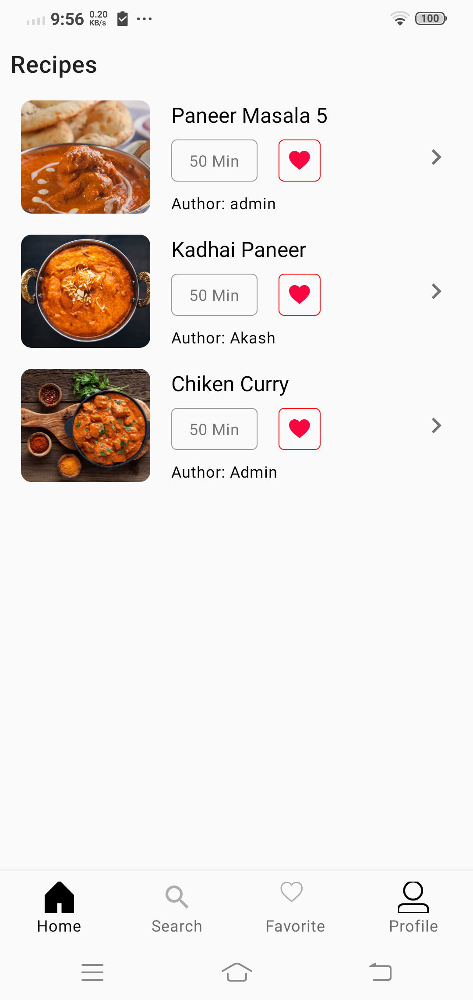
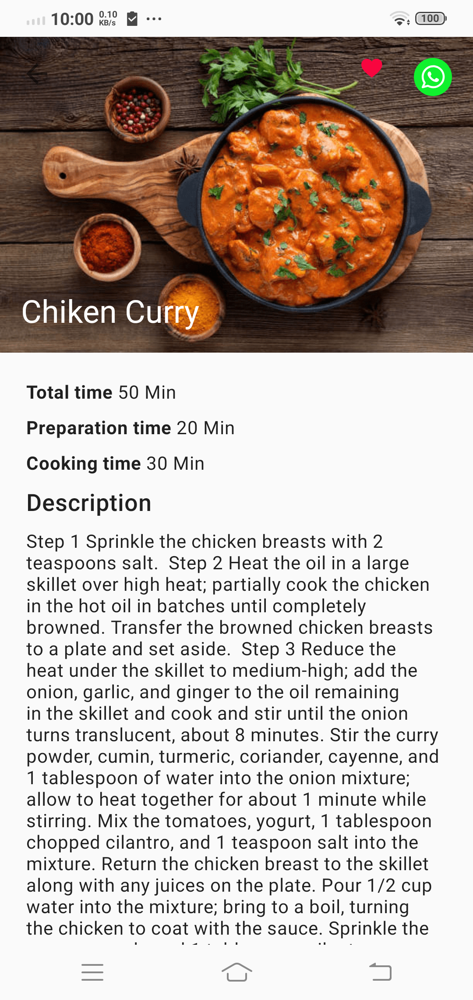

Recipe-Finder Android App
======================

# Description

This project is the Android app for Displayinh and Searching the recipes.

# Features

The app displays a list of recipes - searches, saved recipes,
etc. - and allows the user to filter these recipes by preference
types (Veg, noveg, etc.). Users can see details about
recipes, and they can favorite recipe that liked.

  
  
  

# Development Environment

The app is written entirely in Kotlin and uses the Gradle build system.

To build the app, use the `gradlew build` command or use "Import Project" in
Android Studio. 
# Architecture

The architecture is built around
[Android Architecture Components](https://developer.android.com/topic/libraries/architecture/)
and follows the recommendations laid out in the
[Guide to App Architecture](https://developer.android.com/jetpack/docs/guide). Logic is kept away
from Activities and Fragments and moved to
[ViewModel](https://developer.android.com/topic/libraries/architecture/viewmodel)s.
Data is observed using
[Kotlin Flows](https://developer.android.com/kotlin/flow/stateflow-and-sharedflow)
and the [Data Binding Library](https://developer.android.com/topic/libraries/data-binding/)
binds UI components in layouts to the app's data sources.

The Repository layer handles data operations. Recipes's data comes
from Server -  user data is stored in
(either remotely or in
a local cache for offline use), user preferences and settings are stored in
DataStore, recipes data is stored remotely and is fetched and stored
in memory for the app to use, etc. - and the repository modules
are responsible for handling all data operations and abstracting the data sources
from the rest of the app.

A lightweight domain layer sits between the data layer
and the presentation layer, and handles discrete pieces of business logic off
the UI thread. See the `.\*UseCase.kt` files under `shared/domain` for
[examples](https://github.com/google/iosched/search?q=UseCase&unscoped_q=UseCase).

The [Navigation component](https://developer.android.com/guide/navigation) is used
to implement navigation in the app, handling Fragment transactions and providing a consistent
user experience.

[Room](https://developer.android.com/jetpack/androidx/releases/room) is used
for Full Text Search using [Fts4](https://developer.android.com/reference/androidx/room/Fts4)
to search for a recipe name.

The [Jetpack Benchmark library](https://developer.android.com/studio/profile/benchmark)
makes it easy to benchmark your code from within Android Studio.
The library handles warmup, measures your code performance, and outputs benchmarking
results to the Android Studio console. We added a few benchmark tests around
critical paths during app startup - in particular, the parsing of the bootstrap
data. This enables us to automate measuring and monitoring initial startup time.
Here is an example from a benchmark run:

Dependency Injection is implemented with
[Hilt](https://developer.android.com/training/dependency-injection/hilt-android). For more details
on migrating from *dagger-android* to Hilt, read the
([migration article](https://medium.com/androiddevelopers/migrating-the-google-i-o-app-to-hilt-f3edf03affe5).

[ViewPager2](https://developer.android.com/training/animation/screen-slide-2) offers enhanced functionality over the
original ViewPager library, such as right-to-left and vertical orientation support.
For more details on migrating from ViewPager to ViewPager2, please see this
[migration guide](https://developer.android.com/training/animation/vp2-migration).

## Firebase

The app makes considerable use of the following Firebase components:

- [Cloud Firestore](https://firebase.google.com/docs/firestore/) is our source
for all user data (events starred or reserved by a user). Firestore gave us
automatic sync  and also seamlessly managed offline functionality
for us.
- [Firebase Cloud Functions](https://firebase.google.com/docs/functions/)
allowed us to run backend code. The reservations feature heavily depended on Cloud
Functions working in conjuction with Firestore.
- [Firebase Cloud Messaging](https://firebase.google.com/docs/cloud-messaging/concept-options)
let us inform the app about changes to conference data on our server.
- [Remote Config](https://firebase.google.com/docs/remote-config/) helped us
manage in-app constants.

For 2020, the implementation was migrated to the Firebase Kotlin extension (KTX) libraries to
write more idiomatic Kotlin code when calling Firebase APIs. To learn more,
read this
[Firebase blog article](https://firebase.googleblog.com/2020/03/firebase-kotlin-ga.html)
on the Firebase KTX libraries.

## Kotlin

The app is entirely written in Kotlin and uses Jetpack's
[Android Ktx extensions](https://developer.android.com/kotlin/ktx).

Asynchronous tasks are handled with
[coroutines](https://developer.android.com/kotlin/coroutines). Coroutines allow for simple
and safe management of one-shot operations as well as building and consuming streams of data using
[Kotlin Flows](https://developer.android.com/kotlin/flow).

All build scripts are written with the
[Kotlin DSL](https://docs.gradle.org/current/userguide/kotlin_dsl.html).

# Copyright

    Copyright 2021 Deepak Dawade.

    Licensed under the Apache License, Version 2.0 (the "License");
    you may not use this file except in compliance with the License.
    You may obtain a copy of the License at

        http://www.apache.org/licenses/LICENSE-2.0

    Unless required by applicable law or agreed to in writing, software
    distributed under the License is distributed on an "AS IS" BASIS,
    WITHOUT WARRANTIES OR CONDITIONS OF ANY KIND, either express or implied.
    See the License for the specific language governing permissions and
    limitations under the License.

